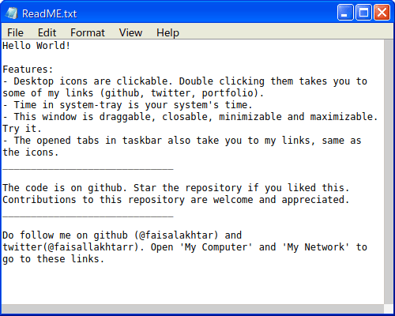

# Windows XP

[](LICENSE)

A replication of the awesome Windows-XP made by using only the web tools and no library. All rights reserved to <a href="https://www.microsoft.com/en-in">Microsoft&reg;</a>


## Features

<table>
  <tr>
    <td><h3>SNo</h3></td>
    <td><h3 align="center">Screenshots</h3></td>
  </tr>

  <tr>
    <td>1.</td>
    <td>
      <p align="center">
      
      <br />
      Splash Screen
      </p>
    </td>
  </tr>
  <tr>
    <td>2.</td>
    <td>
      <p align="center">
      
      <br />
      Welcome Screen
      </p>
    </td>
  </tr>

  <tr>
    <td>3.</td>
    <td>
      <p align="center">
      
      <br />
      Desktop
      </p>
    </td>
  </tr>
  <tr>

  <td>4.</td>
    <td>
      <p align="center">
      
      <br />
      Notepad
      </p>
    </td>
  </tr>
</table>


## Contributing

### Step 1
- Option 1
  - :fork_and_knife: Fork this repository
- Option 2
  -  :dancers: Clone this repo to your local machine using ```git clone https://github.com/faisalakhtar/windows-xp.git```

### Step 2
- **HACK AWAY** :hammer: :hammer: :hammer:

### Step 3
- :repeat: Create a pull request using https://github.com/faisalakhtar/windows-xp/compare/


## License

[](LICENSE)

Full license: [Mozilla Public License V2.0](LICENSE)

Translation: Ofcourse you can use this for you project! Just make sure to say where you got this from :)
